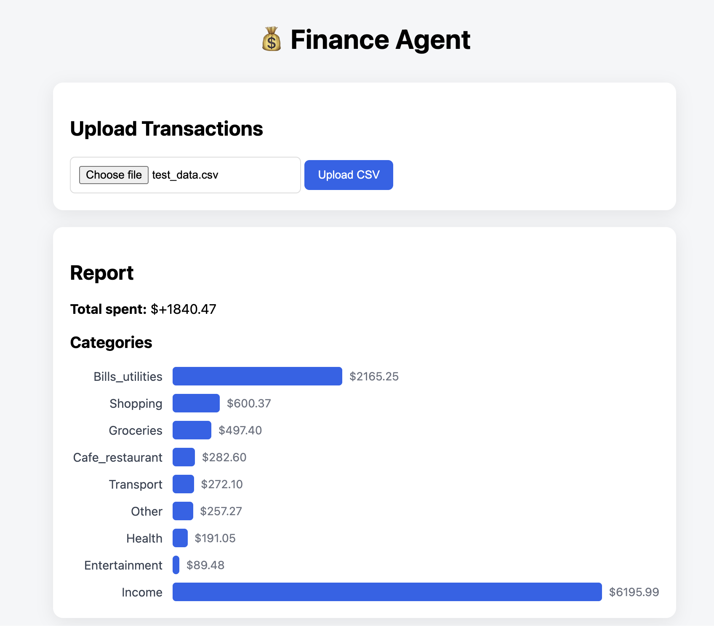
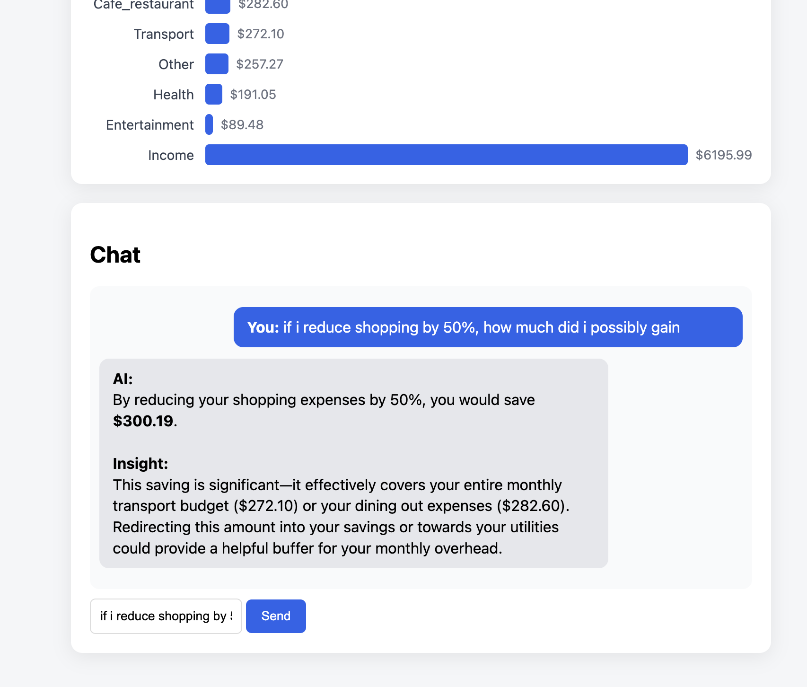

# Finance Agent

A personal finance analysis tool that lets you upload a bank transaction CSV, automatically categorises every transaction with a trained ML model, detects anomalies, and lets you ask plain-English questions answered by an LLM agent powered by Google Gemini.

---

## Screenshots

### Spending by Category


### AI Chat


---

## Features

- **CSV upload** — paste in any bank export and get an instant spending breakdown
- **ML categorisation** — a TF-IDF + Logistic Regression model classifies transactions into categories (food, transport, health, entertainment, shopping, and more)
- **Anomaly detection** — flags transactions that deviate more than 2 standard deviations from your average spend
- **Spending summary** — total spend and per-category breakdown served via REST API
- **AI chat agent** — ask natural-language questions ("Why did I overspend in March?") and get data-backed answers via a Gemini-powered tool-use agent

---

## Tech Stack

| Layer | Technology |
|---|---|
| Backend API | FastAPI |
| ML model | scikit-learn (TF-IDF + Logistic Regression) |
| LLM / AI agent | Google Gemini (`gemini-3-flash-preview`) |
| Frontend | Vanilla HTML / CSS / JavaScript |
| Data | Synthetic CSV transactions (generated locally) |

---

## Project Structure

```
finance-agent/
├── backend/
│   ├── api.py               # FastAPI app — /analyze and /chat endpoints
│   ├── agent.py             # LLM tool-use agent (decision + execution loop)
│   ├── categorization.py    # ML-based transaction categoriser
│   ├── anomaly_detection.py # Statistical anomaly detection
│   ├── data_processing.py   # Aggregation helpers (totals, categories, date range)
│   ├── llm_insights.py      # One-shot LLM insight generator
│   ├── report.py            # Report formatting
│   └── train_model.py       # Model training script
├── frontend/
│   ├── index.html
│   ├── styles.css
│   └── app.js
├── models/
│   └── category_model.pkl   # Trained TF-IDF + LR model (git-ignored)
├── data/                    # CSV files (git-ignored)
├── data-generator.py        # Synthetic transaction generator
└── docs/                    # Screenshots and assets
```

---

## Getting Started

### Prerequisites

- Python 3.10+
- A Google Gemini API key

### 1. Clone the repo

```bash
git clone https://github.com/your-username/finance-agent.git
cd finance-agent
```

### 2. Install dependencies

```bash
pip install fastapi uvicorn pandas scikit-learn google-generativeai python-multipart
```

### 3. Set your API key

```bash
export GOOGLE_API_KEY=your_key_here
```

### 4. Train the model

```bash
cd backend
python train_model.py
```

### 5. Start the backend

```bash
cd backend
uvicorn api:app --reload
```

### 6. Open the frontend

Open `frontend/index.html` directly in your browser, or serve it with any static file server.

---

## How It Works

1. **Upload** a CSV file with columns `date`, `description`, `amount`.
2. The backend **categorises** each transaction using the trained ML model, falling back to keyword rules if confidence is low.
3. **Anomalies** are detected statistically (2σ threshold).
4. The `/analyze` response populates the **bar chart** in the UI.
5. Ask a question in the **chat panel** — the agent picks the right tool (`get_summary`, `get_category_breakdown`, `get_anomalies`, `get_overspending`, or `get_date_range`), runs it against your data, then passes the result to Gemini to generate a clear, concise answer.

---

## Adding Your Screenshots

Drop your screenshots into the `docs/` folder:

```
docs/screenshot-categories.png   ← spending bar chart
docs/screenshot-chat.png         ← AI chat panel
```

They will appear automatically at the top of this README.
